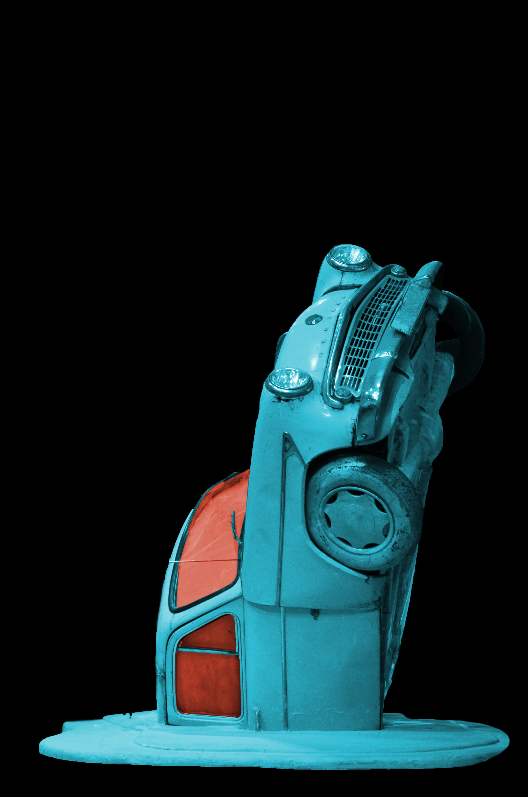

<br><br>

<p align="center">
<a href=https://github.com/alexisveryreal"></a>
<br>

</p>
<br>

# Carduino
EGG 101 Carduino

### Prerequisites

```
Arduino IDE
Arduino UNO
...
```

## Documentation
The source code of Carduino can be found [here](./robot-car.ino/).

## Built with

* [Arudino IDE](https://www.arduino.cc/en/Main/Software) - To transfer/compile to Carduino

## Authors

* **Alexis Villarreal** - *Initial Work* - [alexisveryreal](https://github.com/alexisveryreal)

See also the list of [contributors](https://github.com/alexisveryreal/Carduino/graphs/contributors) who participated in this project.

## License
This project is licensed under the MIT License - see the [LICENSE.md](LICENSE.md) file for details

## Acknowledgments

* My sheer will

